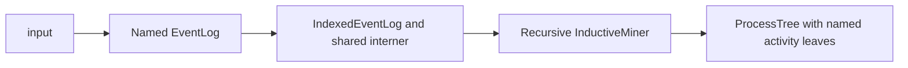

# Architecture

## Overview

The library implements the log-based Inductive Miner framework from Sander Leemans' dissertation [*Robust Process Mining with Guarantees*](https://leemans.ch/publications/theses/phd.pdf). The framework and its proof obligations are described in section 4.2 of the thesis. Algorithms discover a `ProcessTree` by recursively decomposing an `EventLog`. A shared recursive engine handles control flow; reusable components determine base cases, cuts, splitting, and fall-through behaviour.

| Module       | Responsibility                                                                          |
| ------------ | --------------------------------------------------------------------------------------- |
| `model`      | Events, traces, logs, activity identities, graph abstractions, cuts, and process trees. |
| `io`         | Read input into named event logs.                                                       |
| `framework`  | Stage traits, recursive mining, callbacks, and mining errors.                           |
| `components` | Reusable strategies, adapters, and composition combinators.                             |
| `algorithms` | Concrete compositions.                                                                  |

The usual data flow is:



Parsing is independent of mining. Callers can also construct an `EventLog` directly. Algorithm-specific behaviour is described in [docs/algorithms](algorithms/).

## The recursive procedure

[`InductiveMiner<B, C, S, F>`](../src/framework/miner.rs) owns four configured components. Its `Miner::mine` implementation interns the input log once, invokes `mine_node`, and constructs a validated `ProcessTree`.

At each recursion level:

```text
mine_node(log):
    if the base case returns a node:
        validate and return it

    if the cut finder returns a cut:
        validate the cut against the current alphabet
        split the log into one sublog per partition
        validate sublog count, activity membership, and interner identity
        recursively mine each sublog
        combine the child nodes using the cut's operator
        return the operator node

    create callbacks into this configured miner
    invoke the fall-through component
    validate and return its node
```

Every recursive call uses the same component instances and configuration. A sublog's graph is prepared when its cut finder needs it; the framework does not maintain a global graph cache.

Fall-throughs receive callbacks rather than constructing another miner. This keeps custom stages and filtering thresholds consistent during recursion.

## The four stages

The contracts are defined in [`framework/traits.rs`](../src/framework/traits.rs). All stages operate on `IndexedEventLog` internally.

| Trait         | Method                  | Result                     |
| ------------- | ----------------------- | -------------------------- |
| `BaseCase`    | `base_case(log)`        | `Option<Node>`             |
| `DetectCut`   | `detect_cut(log)`       | `Option<IndexedCut>`       |
| `SplitLog`    | `split_log(log, cut)`   | `Vec<IndexedEventLog>`     |
| `FallThrough` | `fall_through(context)` | `Result<Node, MinerError>` |

### Base cases

A base case handles a log simple enough to produce a node immediately.
`None` means that recursion should proceed to cut detection. 

A base-case component resolves interned IDs into named activity leaves. Filtering variants may simplify executions according to `FilteringConfig`.

### Cut detection

A cut specifies an operator and an ordered collection of activity partitions. Partitions must be nonempty, disjoint, cover the current alphabet, and number at least two. Their order defines sequence order and loop body/redo roles.

The framework-facing `DetectCut` trait accepts a log. Reusable ordinary detectors implement `CutStrategy`, which accepts a prepared `CutContext`. `CutFinder` adapts strategies to `DetectCut` and prepares the alphabet and DFG once per call. Minimum self-distance witnesses are computed lazily in the context.

Lifecycle detectors use `NonAtomicCutStrategy` and `NonAtomicCutContext`, which provide a non-atomic DFG and concurrency graph. `NonAtomicCutFinder` is the corresponding framework adapter. Filtering adapters retain original log evidence while supplying a replacement DFG for a second detection pass.

### Log splitting

A splitter returns one sublog per cut partition, in the same order as the partitions. Each sublog may contain only activities from its assigned part and must share the parent log's interner.

Splitting depends on operator semantics: sequence and concurrency commonly use projections; XOR assigns traces to branches; loops can turn several runs of one trace into separate subtraces. Empty traces and duplicate traces are meaningful and must be handled according to the algorithm's rules.

Retained events preserve metadata. Lifecycle filtering may additionally insert synthetic completions through consistency repair.

### Fall-throughs

A fall-through handles logs without an applicable base case or cut. The framework-facing `FallThrough` must return a node or a mining error. Optional strategies implement `FallThroughStrategy` and may return `Ok(None)` to allow another strategy to run.

`FallThroughContext` provides:

- `log`: the current indexed log;
- `recurse`: recursively mine a derived sublog with the current miner;
- `find_cut`: query the current cut finder on a derived sublog.

Strategies can therefore extract activities or split repetitions without hard-coding a specific algorithm. A flower model supplies a final fallback when other strategies do not apply.

## Composition combinators

Algorithms are assembled from generic structs and type aliases. The ordinary pipeline uses static dispatch; callback references provide access to the current miner from fall-through components.

| Combinator                     | Purpose                                                                  |
| ------------------------------ | ------------------------------------------------------------------------ |
| `BaseCaseChain<A, B>`          | Try `A`, then `B` only if `A` returns `None`.                            |
| `CutChain<A, B>`               | Select the first matching cut strategy.                                  |
| `CutFinder<S>`                 | Prepare an ordinary cut context and invoke a strategy or chain.          |
| `LogSplitter<X, S, C, L>`      | Dispatch XOR, sequence, concurrent, and loop cuts to their splitters.    |
| `ExtendedLogSplitter<S, I, O>` | Add interleaved and inclusive-choice splitting to a standard dispatcher. |
| `FallThroughChain<A, B>`       | Try optional strategies in order, propagating errors immediately.        |
| `FallThroughFinder<S, F>`      | Try optional strategies, then a guaranteed fallback.                     |

Nested chains express priority. They select the first applicable result without comparing scores. Probabilistic finders perform scoring and SMT optimization inside their own detection implementation.

## Interner and activity identity

The public log models are generic: `Event<A = Activity>`, `Trace<A = Activity>`, and `EventLog<A = Activity>`. The default `Activity` stores a name; indexed logs use compact, copyable `ActivityId` values.

[`IndexedEventLog`](../src/model/indexed_log.rs) contains an `EventLog<ActivityId>` and an `Arc<ActivityInterner>`. Encoding assigns IDs in lexical activity-name order, making alphabet traversal deterministic. Recursive sublogs retain those IDs even when their local alphabet becomes smaller.

The interner is immutable and provides lookup in both directions:

- `interner().id(&activity)` looks up a name's ID;
- `interner().resolve(id)` returns an optional name;
- `log.resolve(id)` returns the name and panics for an out-of-range index.

IDs are local to one interner. Two independent calls to `indexed()` create separate identity spaces, even when the input logs are equal. The same numeric ID can represent different names in different tables. An in-range foreign ID cannot be detected by name-table bounds checking alone.

Use `parent.with_traces(traces)` to construct derived logs. This preserves the shared table without re-encoding. `shares_interner` checks `Arc` identity rather than table contents. `with_traces` does not validate supplied IDs, so components must copy them from the originating log.

Interning reduces repeated string copying and hashing in graph and cut operations. Cloning an indexed log still clones its trace/event data; only the name table is shared. Output tree leaves resolve IDs back to named `Activity` values, so consumers do not need the interner to interpret the result.

## Validation and error handling

The recursive engine checks component output before recursing on cut-generated sublogs. Fall-through recursion also checks interner identity.

| Error                              | Meaning                                                       |
| ---------------------------------- | ------------------------------------------------------------- |
| `MinerError::Cut`                  | The cut violates its partition contract.                      |
| `MinerError::Tree`                 | A produced node or tree violates structural rules.            |
| `MinerError::InvalidSplitCount`    | The splitter did not return one sublog per partition.         |
| `MinerError::InvalidSplitAlphabet` | A sublog contains an activity outside its assigned partition. |
| `MinerError::DifferentInterner`    | A derived log uses another activity identity table.           |

Node validation checks tree structure, including minimum operator arities. It does not establish fitness, precision, or correct lifecycle semantics. Cut validation checks the alphabet partition; it does not prove the operator's behavioural footprint.

`None` from a base case or detector is normal control flow. It advances the pipeline. Optional fall-through errors propagate without trying later strategies. XES parsing has a separate `XesError` type in `io::read_xes`.

Custom components are responsible for termination: the engine does not enforce a recursion-depth limit or prove that every recursive subproblem is smaller. They must also respect identity and semantic assumptions. Z3 failures currently panic if optimization returns unknown or cannot supply a model; these failures are not represented as `MinerError`.

## Adding a new algorithm

1. **Specify its semantics.** Identify supported operators, input assumptions, stage order, filtering rules, and required evidence from the reference algorithm.
2. **Reuse existing components.** Add reusable behaviour under `components`; keep algorithm-specific composition and configuration under `algorithms`.
3. **Implement missing stages or strategies.** Use the framework traits for complete stages and the strategy traits for detectors that share prepared data.
4. **Compose the pipeline.** Define stage aliases and an `InductiveMiner<BaseCases, CutFinder, Splitter, FallThrough>` alias. Ensure every detected operator has a matching splitter and a final fallback exists.
5. **Configure construction.** Provide `Default` where meaningful and a builder when several components must share configuration.
6. **Export the algorithm.** Declare its module and re-export its public miner from `algorithms/mod.rs`.
7. **Test and document.**

A new composition can be built with `InductiveMiner::new` without modifying the recursive engine.
## Design decisions

### Separate the framework from algorithm policy

The engine implements recursion and validation. Components decide what model to discover. This lets algorithm variants share control flow while changing only the stages required by their semantics.

### Use explicit ordered composition

Chains expose precedence in the algorithm's type definition. Generic components support compile-time trait checking and avoid a mutable global strategy registry. Nested types can become verbose, so stage aliases keep algorithm definitions readable.

### Prepare evidence in adapters

Cut finders own context preparation. Detectors in one chain share the graph and cached evidence. The recursive engine depends on `DetectCut`, so it does not need to know whether a detector uses ordinary DFGs, lifecycle overlap, or probabilities. Caches are local to a detection call and cannot replace preparation for a new sublog.

### Keep activity identity stable during recursion

A shared immutable interner makes derived logs cheap to label and keeps IDs consistent across cuts and splitters. Names are restored when producing leaves. Independent inputs intentionally have separate interners.

### Preserve original evidence during filtering

Filtering changes graph relations while retaining the original log for splitting. Minimum self-distance witnesses and lifecycle overlap evidence are retained by the corresponding filtering adapters. This separates candidate cut detection from handling deviating events.

### Keep I/O and lifecycle interpretation explicit

The XES reader preserves document event order and metadata. Ordinary miners do not automatically sort timestamps or interpret start/completion pairs. Lifecycle miners use specialized abstractions; consistency repair is applied explicitly by filtering splitters. Input normalization remains a separate concern.